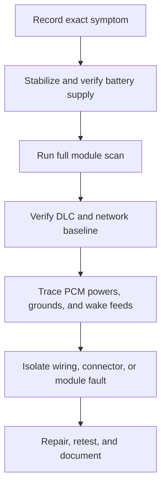

# vandiag

AI-assisted, evidence-based diagnosis of a no-start and communication fault on a Ford Transit Custom.

This repository is the shared diagnostic record. Its purpose is to keep the investigation systematic, prevent repeated work, and give an AI assistant enough reliable context to suggest **one safe test at a time**.

> [!WARNING]
> Vehicle electrical work can cause fire, component damage, or unexpected vehicle movement. Disconnect power when appropriate, use fused test leads, never probe airbag/SRS circuits with a test light or ohmmeter, and do not bypass immobilizer or safety systems. If a procedure is unclear or requires powered high-current testing, stop and verify it with the workshop information or a qualified automotive electrician.

## Vehicle

| Field | Value |
| --- | --- |
| Make/model | Ford Transit Custom V362 |
| Body | L2H2 panel van |
| Engine | 2.2 TDCi, 125 PS (92 kW), 2,198 cc |
| First registration | 2016-04-15 |
| VIN | Not stored publicly; add only to a private copy if needed |
| System voltage | 12 V |

Before relying on a wiring-diagram page, confirm that its engine, production date, steering position, and equipment options match this vehicle.

## Main problem

The van does not start after the starter batteries were changed. The ignition powers up and the vehicle beeps, but communication with the PCM fails in FORScan. The exact start behavior still needs to be recorded as either:

- [ ] **No crank:** starter does not turn the engine
- [ ] **Crank, no start:** starter turns the engine but it does not run
- [ ] **Starts and stalls**

Do not treat old EGR/MAF drivability symptoms as the cause of the current no-start unless new evidence links them.

## Wiring diagram

- Repository file: [`Ford-Transit-Custom-1-2012-2020-–-Wiring-Diagrams.pdf`](./Ford-Transit-Custom-1-2012-2020-%E2%80%93-Wiring-Diagrams.pdf)
- Source: [Ford Transit Custom 2012–2020 wiring diagrams](https://fixmycarinfo.com/wp-content/uploads/2025/01/Ford-Transit-Custom-1-2012-2020-%E2%80%93-Wiring-Diagrams.pdf)

Record both the **PDF page number** and the **printed diagram/page identifier** when citing it, because PDF numbering can differ from the document's printed numbering.

## Known diagnostic history

The entries below are historical reports and must not silently be promoted to confirmed measurements. Repeat only when the result is important and the original test conditions are unknown.

| ID | Status | Observation / work performed | Conditions or limitations |
| --- | --- | --- | --- |
| H-01 | Reported | Problem appeared after battery replacement | Timing does not prove causation |
| H-02 | Reported | Ignition powers up; warning sounds are present; engine does not start | Confirm exact no-crank/crank-no-start behavior |
| H-03 | Reported | FORScan cannot communicate with the PCM | Record adapter, selected CAN mode, and full module scan |
| H-04 | Reported | Garage stated that the PCM powers up but has no output | Meaning of “no output” and test points are unknown |
| H-05 | Reported | ABS was also reported as not functioning | Retrieve exact DTCs/module communication result |
| H-06 | Measured previously | Resistance across OBD-II pins 6 and 14 was approximately 118–120 Ω | Battery state, sleep time, network isolation, and meter setup unknown |
| H-07 | Measured previously | CAN-H approximately 2.50 V and CAN-L approximately 2.41 V | Measurement conditions and meter reference unknown |
| H-08 | Checked previously | Engine-bay F14 5 A and F15 40 A reportedly OK; passenger-compartment F14 reportedly OK | Visual checks alone are insufficient; verify voltage on both fuse test points under the correct key state |
| H-09 | Measured previously | Prefuses F10/F11 reportedly had 12 V | Exact reference ground and load conditions unknown |
| H-10 | Reported | BCM was removed, sent to an external company, tested, and declared OK | Obtain the external test report if possible |
| H-11 | Observed previously | R2 became hot; R17 produced a whining sound | Relay identities must be confirmed against the correct diagram/legend |
| H-12 | Measured previously | “Pin 2 no feed” and F35 about 0.04 V without a relay were noted | Connector, component, expected state, and ground reference not documented |

### Earlier, probably separate drivability issue

Before the current no-start, the van surged at light throttle while engine speed stayed relatively stable. MAF readings reportedly varied around 4.7–17.2 g/s and EGR actual position oscillated. It drove better with the MAF unplugged and then logged P0113. Preserve this history, but investigate the current network/power/start fault first.

## Working rules for the AI assistant

When using an AI model with this repository, ask it to follow these rules:

1. Read this README and the latest diagnostic log before proposing a test.
2. Separate **facts**, **reported history**, **measurements**, **assumptions**, and **hypotheses**.
3. Use the supplied wiring diagram as the primary source for connector, splice, fuse, relay, ground, and pin information. Cite the PDF page plus printed identifier. Never invent a pinout.
4. Check that a diagram applies to this exact engine/build before using it.
5. Propose one logical test step at a time, starting with the safest and least invasive.
6. For each test, state:
   - why it is useful;
   - ignition/key and battery state;
   - connector connected or disconnected;
   - exact probe points and meter mode;
   - expected result or meaningful ranges;
   - what each possible result means;
   - risks and stop conditions.
7. Prefer voltage-drop and loaded-circuit tests over continuity alone when checking power and grounds.
8. Do not recommend replacing a module solely because it cannot communicate. First verify its powers, grounds, relevant network wiring, wake-up/ignition feeds, and network topology.
9. Do not assume that a post-battery-change fault means reverse polarity, a failed PCM, or a failed BCM without evidence.
10. Do not repeat a completed test unless its setup was incomplete, its result conflicts with other evidence, or repeating it under different conditions has clear diagnostic value.
11. Ask for missing details rather than guessing. Mark uncertain diagram interpretations explicitly.
12. End every response with the single next recommended action and the exact result(s) the user should report back.

## Suggested AI prompt

```text
Act as a careful automotive electrical diagnostic assistant for this repository.

Read README.md, the latest entries in diagnostics/log.md, and the relevant pages
of the supplied wiring-diagram PDF. Diagnose from evidence; do not jump to parts
replacement. Clearly separate confirmed facts, reported history, hypotheses, and
unknowns. Never invent connector names, pin numbers, wire colors, expected values,
or diagram references.

Give me one safe, high-information test at a time. For that test specify the key
state, battery state, connector state, meter setting, reference point, exact probe
locations, expected outcome, interpretation of each result, and safety warnings.
Cite the PDF page number and printed diagram identifier used. Finish by telling me
exactly which readings or observations to add to diagnostics/log.md.

Current goal: determine why the van does not start and why FORScan cannot
communicate with the PCM, without replacing modules based on assumptions.
```

## Diagnostic workflow



The order can change when a result points strongly elsewhere, but the reason must be recorded.

## Initial checklist

### 0. Preserve information before testing

- [ ] Photograph battery terminals, fuse boxes, disconnected connectors, and any non-original wiring.
- [ ] Record whether the engine does not crank, cranks without starting, or starts and stalls.
- [ ] Record dashboard warning lamps before, during, and after a start attempt.
- [ ] Record whether the immobilizer/theft indicator behaves normally.
- [ ] Obtain the garage's job sheet, full scan report, measurements, and BCM test report.
- [ ] Record exactly what changed during the battery replacement, including polarity events, sparks, jump leads, or charger use.

### 1. Battery and main distribution baseline

- [ ] Identify the two-battery configuration and document how both batteries are connected.
- [ ] Measure each battery at rest and during a start attempt; record at the battery posts, not the clamps.
- [ ] Inspect and load/voltage-drop test main positive and negative paths.
- [ ] Verify relevant prefuses and fuses with voltage on both test points in the required key state.
- [ ] Confirm engine/body grounds using the wiring diagram and voltage-drop testing.

### 2. Define the communication fault

- [ ] Record FORScan version, adapter model, adapter switch/automatic mode, and connection profile.
- [ ] Save the complete module discovery result and all DTCs, including U-codes.
- [ ] List modules that communicate and modules that do not; do not write only “CAN not working.”
- [ ] Verify DLC pin 16 power and pins 4/5 grounds under load.
- [ ] Recheck network resistance only with power removed, modules asleep, and the test setup documented.
- [ ] Measure CAN voltages and, if available, capture waveforms with an oscilloscope.

### 3. PCM circuit verification

- [ ] Identify the exact PCM, connector views, fuse feeds, relays, grounds, and network pins from the applicable diagram.
- [ ] Verify constant battery feeds at the PCM under load.
- [ ] Verify ignition/wake feeds in the correct key state.
- [ ] Voltage-drop test each PCM ground during key-on and, if applicable, cranking.
- [ ] Verify PCM relay command and switched output; identify why any relay becomes hot or whines.
- [ ] Inspect PCM and related connectors for backed-out pins, water, corrosion, spreading, or damage.

### 4. Network isolation, only if justified

- [ ] Map both termination resistors and relevant gateways/modules before disconnecting anything.
- [ ] Use the diagram and measured topology to explain the approximately 120 Ω reading.
- [ ] Isolate branches/modules methodically, with ignition off and battery disconnected where required.
- [ ] Reconnect and document every connector before moving to the next step.

### 5. Confirm the repair

- [ ] Repeat the full module scan.
- [ ] Confirm PCM communication is stable through multiple key cycles.
- [ ] Confirm correct crank/start behavior.
- [ ] Clear DTCs only after saving them, then note which return.
- [ ] Perform a controlled road test only when the vehicle is safe.
- [ ] Record root cause, repair, part numbers, and before/after measurements.

## Diagnostic log format

Create `diagnostics/log.md` and append entries—never rewrite history to match a later theory.

```markdown
## T-001 — Short test name

- Date/time:
- Performed by:
- Goal:
- Source: PDF page ___; printed diagram/section ___
- Vehicle state: battery voltage ___ V; key ___; engine ___
- Tool and mode:
- Connector state:
- Reference/ground point:
- Probe points:
- Expected result:
- Actual result:
- Interpretation:
- Evidence files/photos:
- Next action:
```

Use sequential IDs (`T-001`, `T-002`, …). If a result is corrected later, add a new entry referring to the original ID.

## Recommended repository layout

```text
vandiag/
├── README.md
├── Ford-Transit-Custom-1-2012-2020-–-Wiring-Diagrams.pdf
├── diagnostics/
│   ├── log.md                 # Append-only test results
│   ├── dtc-history.md         # DTCs with date, module, status, and freeze-frame data
│   └── hypotheses.md          # Ranked hypotheses and evidence for/against each
├── evidence/
│   ├── scans/                 # FORScan exports and garage reports
│   ├── measurements/          # Scope captures and meter readings
│   └── photos/                # Connectors, fuse boxes, grounds, wiring
└── references/
    └── diagram-notes.md       # Relevant page, circuit, connector, splice, and ground index
```

Avoid committing personal data such as VIN, registration documents, addresses, license plates, access tokens, or unredacted garage paperwork to a public repository.

## Hypothesis tracking

Rank hypotheses by how well they explain **all** observations, not by how expensive or familiar the suspected part is.

| Hypothesis | Evidence for | Evidence against | Discriminating test | Status |
| --- | --- | --- | --- | --- |
| Open/missing CAN termination or network path | Previous DLC resistance around 118–120 Ω | Test conditions not recorded | Repeat resistance test correctly; map terminations in diagram | Open |
| Missing PCM power, ground, relay output, or wake feed | PCM communication failure; relay/fuse observations | PCM reportedly powers up, but evidence is incomplete | Loaded feed tests and ground voltage-drop tests at PCM | Open |
| Connector, splice, fuse-box, or harness fault | Multiple communication/electrical symptoms | No fault location confirmed | Diagram-led point-to-point measurements and inspection | Open |
| PCM internal fault | PCM does not communicate | External circuits have not yet been fully verified | Verify all external requirements and network integrity first | Unproven |
| BCM fault | BCM/network involvement is possible | BCM was externally tested and declared OK | Obtain report; verify in-vehicle inputs/outputs only if evidence points here | Lower priority |

## Definition of done

The diagnosis is complete when the repository shows:

- a reproducible original symptom;
- a verified root cause supported by measurements;
- the repair performed;
- before/after scan and electrical evidence;
- successful start and communication tests; and
- any remaining DTCs or unrelated issues clearly documented.

